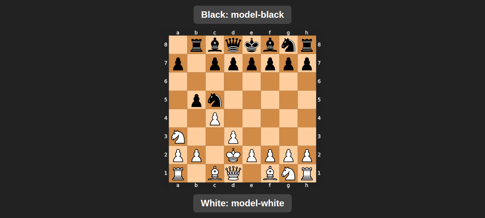

# AI Chess Arena

A Python interactive script to play chess via terminal and a browser UI. Features modes for Player vs Player, Player vs LLM, and LLM vs LLM. It uses the `python-chess` library for game logic and sends the board state in FEN format to an LLM API.

## Features
- **3 Game Modes**: 
  - Player vs Player
  - Player vs LLM (Choose to play as White or Black)
  - LLM vs LLM
- **Automatic move validation**: If an LLM hallucinates (proposes an illegal move), the script automatically forces a random legal move to prevent the game from freezing.
- **Auto-refreshing Browser UI**: Displays the chess board and the competing models.



## Requirements
- Python 3
- `pip install chess`
- A running local LLM endpoint compatible with the OpenAI API format (default URL: `http://localhost:20128/v1/chat/completions`)

## Configuration
Open `chess_game.py` and modify:
- `YOUR_API_KEY_HERE`: Replace with your actual LLM API key.
- Endpoints and models can be modified depending on your local LLM setup.

## How to Run
```bash
python3 chess_game.py
```
Follow the interactive prompts in the terminal to set up the match.